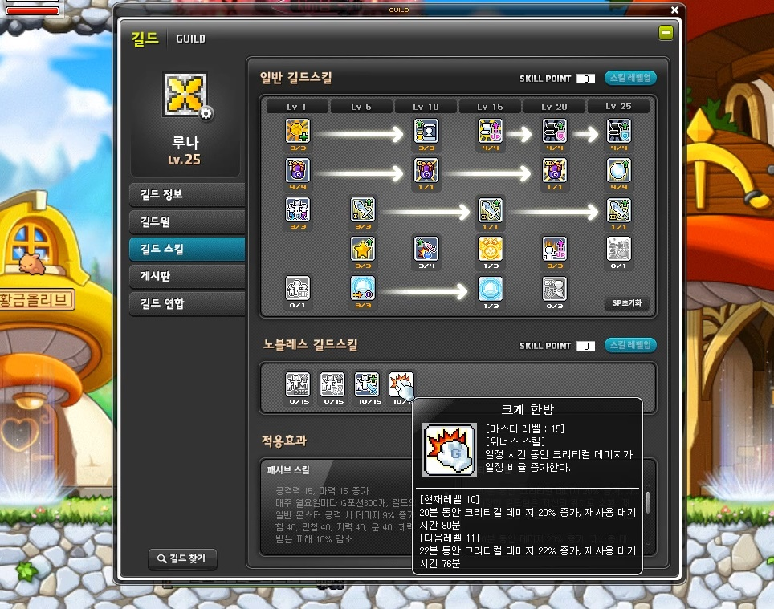

# 마크다운 문법

## 제목(heading)

제목은 `#`으로 작성하며, 갯수로 제목의 레벨을 나타낸다.


### 제목3

#### 제목4

##### 제목5

###### 제목6

## 목록

목록은 순서가 있는 목록과 없는 목록으로 구분된다.

1. 순서가 있는 목록입니다.

2. 순서가 있습니다.

   1. tab을 통해 목록의 레벨을 설정할 수 있습니다.
   2. 엔터

   엔터

3. 엔터

엔터

* 순서가 없는 목록
  * tab을 통해 레벨

## 코드 블록

```python
# python 주석
-- sql 주석
print('hello')
def foo():
    return bar
```

```sql
-- sql에서 주석
SELECT * FROM tables;
```

```bash
$ git init
```

## 인용문 

> 인용문 작성가능


## 링크

[google](https://google.com)로 가기! ctrl + click


## 표

| 순번 | 이름 |
| ---- | ---- |
| 1    | 홍   |
| 2    | 철   |
| 3    | 영   |

## 이미지 삽입


* 기본 설정으로는 이미지의 절대경로가 표시되는데, 아래의 설정을 typora에 한다
* 파일>환경설정>이미지 탭 클릭
  * copy image to custom folder 선택
    * `./images`
  * 로컬 이미지에 위 규칙적용
  * 온라인 이미지에 위 규칙적용
  * 가능하다면 상대적 위치사용
  * 모드 체크




## 기타

수직선

---

**굵게(볼드체)**

*기울임(이탤릭체)*

~~취소선~~ <- 물결 2개